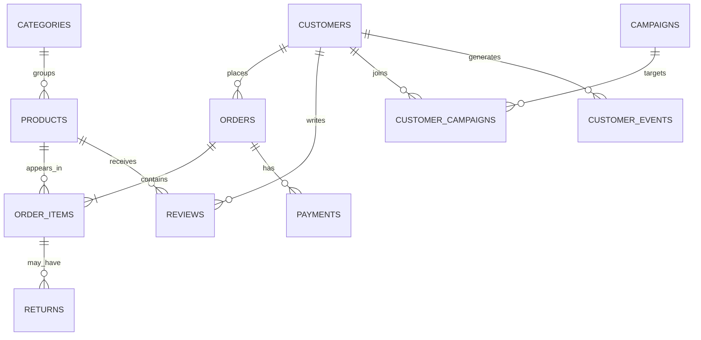

# ER Diagram

```mermaid
erDiagram
    CUSTOMERS ||--o{ ORDERS : places
    ORDERS ||--|{ ORDER_ITEMS : contains
    PRODUCTS ||--o{ ORDER_ITEMS : appears_in
    CATEGORIES ||--o{ PRODUCTS : groups
    ORDERS ||--o{ PAYMENTS : has
    ORDER_ITEMS ||--o{ RETURNS : may_have
    CUSTOMERS ||--o{ REVIEWS : writes
    PRODUCTS ||--o{ REVIEWS : receives
    CUSTOMERS ||--o{ CUSTOMER_CAMPAIGNS : joins
    CAMPAIGNS ||--o{ CUSTOMER_CAMPAIGNS : targets
    CUSTOMERS ||--o{ CUSTOMER_EVENTS : generates
```
